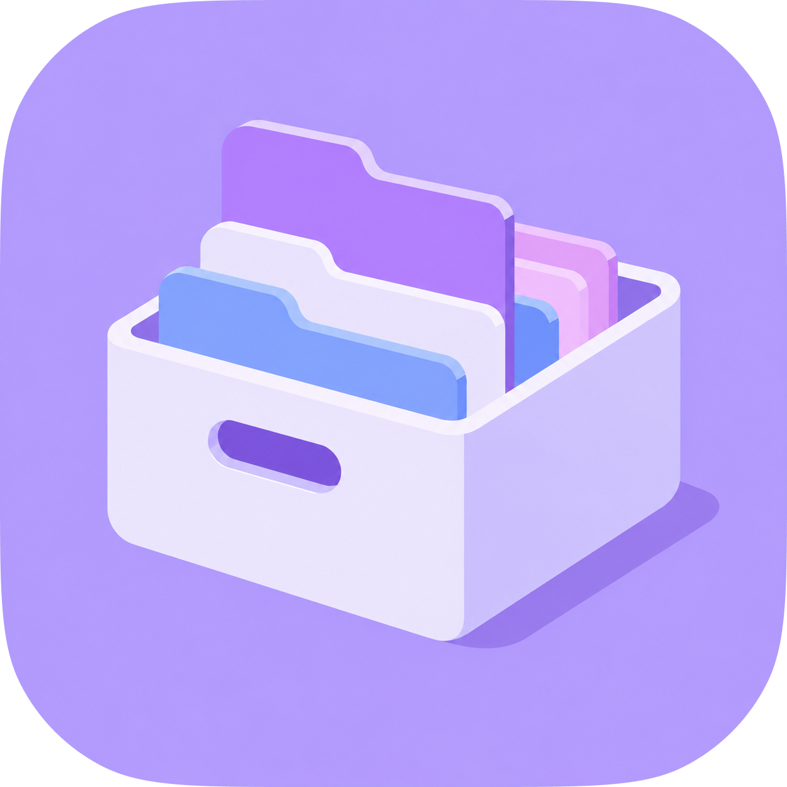
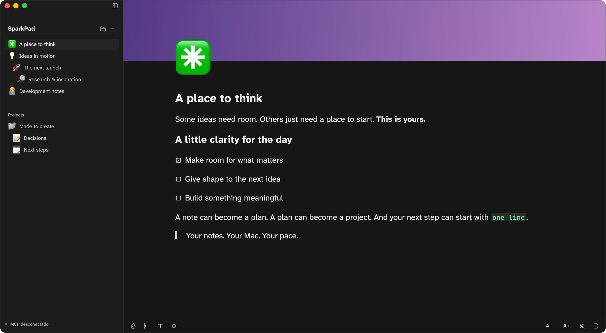

<p align="center">
  <a href="https://sparkpad.mplabs.sh">
    
  </a>
</p>

<h1 align="center">Sparkpad</h1>

<p align="center">
  <strong>A little room for your ideas to take shape.</strong><br />
  Native notes for Mac. The freedom of a block editor. Your AI agents, in the same space.
</p>

<p align="center">
  <a href="https://sparkpad.mplabs.sh"></a>
  <a href="Cargo.toml"></a>
  <a href="#your-agents-in-the-same-space"></a>
  <a href="#your-notes-truly-yours"></a>
  <a href="LICENSE"></a>
</p>

<p align="center">
  <a href="https://sparkpad.mplabs.sh"><strong>Website</strong></a> ·
  <a href="https://sparkpad.mplabs.sh/downloads/Sparkpad-macOS.zip"><strong>Download for Mac</strong></a> ·
  <a href="#getting-started"><strong>Getting started</strong></a> ·
  <a href="#your-agents-in-the-same-space"><strong>MCP setup</strong></a> ·
  <a href="https://github.com/mpires-dev/sparkpad/issues"><strong>Report an issue</strong></a>
</p>

<br />

<p align="center">
  
</p>

<p align="center"><sub>A real app screenshot with example notes. Built with Rust and GPUI.</sub></p>

---

## Think. Write. Connect.

Sparkpad is an open-source, native macOS notes app inspired by the simplicity of Markdown and the flexibility of block editing. Capture an idea, turn it into a page, and organize it into a project. Connect an MCP client when you want an agent to help.

No account. No subscription. Notes are stored on your Mac, and the interface renders through Rust + GPUI, without a WebView.

| Write in your own way | Give ideas a home | Bring your agents along |
| :--- | :--- | :--- |
| Edit headings, lists, tasks, quotes, and code directly in your notes. | Nest pages, organize sidebar groups, and drag entire branches into place. | Let Claude Code, Codex, or another MCP client create, edit, and organize notes. |
| Use a keyboard-friendly `/` menu and rich text shortcuts. | Add emoji, SVG, or image icons, plus colorful covers and gradients. | Read and edit individual blocks, customize pages, and update app preferences. |
| Highlight code, select its language, indent with Tab, and copy it in one click. | Choose light or dark mode, three fonts, and your preferred content width. | Keep edits safe with revision checks and shared local storage. |

## Getting started

### Download for macOS

[**Download Sparkpad for Mac →**](https://sparkpad.mplabs.sh/downloads/Sparkpad-macOS.zip)

The current download is an Apple Silicon build. Extract the archive and move `Sparkpad.app` to Applications. The app is ad hoc signed and is not currently notarized; macOS may require approval in **System Settings → Privacy & Security** before opening it.

### Build from source

You need macOS 12 or later, Rust with Cargo, and the Xcode Command Line Tools. The UI dependencies are included in the repository.

```sh
git clone https://github.com/mpires-dev/sparkpad.git
cd sparkpad
xcode-select --install  # if the Command Line Tools are not installed
cargo run --locked
```

To create an application bundle:

```sh
./scripts/bundle.sh
open "dist/Sparkpad.app"
```

Use `./scripts/bundle.sh release` for an optimized distribution build.

## Make room to write

- **Blocks that stay out of your way.** Edit in place, split and merge paragraphs, reorder blocks, and select text across the whole page. Empty blocks between paragraphs remain empty; only the last empty block shows a placeholder.
- **Code that feels like code.** Tree-sitter highlighting, language selection including JSX and TSX, two-space indentation, and a dedicated copy button. Inside a code block, Select All selects the code and formatting shortcuts stay out of the way.
- **A sidebar that grows with you.** Pages within pages, manual groups, drag-and-drop ordering, keyboard navigation, and persisted expanded branches.
- **A page that feels like yours.** Emoji and Iconoir icons, uploaded images, solid and gradient covers, light and dark themes, and sans, serif, or monospace text.
- **A native companion.** Dock and menu bar access, adjustable opacity, an optional always-on-top window, and saved window position and sidebar width.
- **Rich clipboard support.** Copy and paste headings, lists, tasks, links, code, and inline formatting through HTML and Markdown, including exchanges with editors such as Notion.

### Keyboard shortcuts

| Shortcut | Action |
| :--- | :--- |
| `/` at the start of a paragraph | Open the block menu; use ↑ / ↓, Enter, and Esc |
| ⌘ N | Create a note |
| ⇧ ⌘ B | Toggle the sidebar |
| ⌘ B / ⌘ I / ⌘ U / ⌘ E | Bold, italic, underline, or inline code |
| ⌘ A | Select the page content, or just the focused code block |
| ⌘ Z / ⇧ ⌘ Z | Undo / redo |
| ⌘ Enter | Hide editing tools |
| Enter / ⇧ Enter | Split a block / insert a line break |
| Tab / ⇧ Tab in code | Indent / outdent |
| ⇧ ⌘ V | Paste plain text |
| Esc | Dismiss an open menu, or hide the panel |

## Your agents, in the same space

Sparkpad includes an **MCP server over stdio** in the same executable. A client launches a separate process that shares the app's local SQLite database. Agents can work with notes even when the UI is closed; `show_panel` requires the app to be running.

Build the executable, then register it from the repository root:

```sh
cargo build --locked

# Codex
codex mcp add sparkpad -- "$PWD/target/debug/sparkpad" mcp

# Claude Code
claude mcp add --scope user sparkpad -- "$PWD/target/debug/sparkpad" mcp
```

For other MCP clients:

```json
{
  "mcpServers": {
    "sparkpad": {
      "command": "/absolute/path/to/sparkpad/target/debug/sparkpad",
      "args": ["mcp"]
    }
  }
}
```

For a bundled installation, use the absolute path to `Sparkpad.app/Contents/MacOS/sparkpad` instead. Reconnect your client after updating the executable to refresh its tools.

> Create a launch planning page with subpages for research, decisions, and next steps. Add a checklist, organize the pages in a project group, and show the main page in Sparkpad.

<details>
<summary><strong>Explore all 25 MCP tools</strong></summary>

| Tools | What they do |
| :--- | :--- |
| `list_notes`, `get_note` | Read notes, Markdown, IDs, and revisions |
| `create_note`, `update_note`, `patch_note` | Create pages, replace content, or patch a unique text passage |
| `move_note`, `delete_note` | Move a page and its descendants, or delete with revision checks |
| `select_note`, `show_panel` | Select a page and show the running app |
| `list_sidebar_groups`, `create_sidebar_group` | Read and create top-level groups |
| `rename_sidebar_group`, `delete_sidebar_group` | Rename groups, or remove a group while keeping its pages |
| `move_note_to_group` | Assign a page and its subtree to a group, or return it to the root |
| `get_sidebar_tree`, `reorder_sidebar` | Read the complete ordered hierarchy and reorder siblings |
| `get_note_presentation`, `search_page_icons`, `set_note_icon` | Read page appearance, search icons, and set emoji, SVG, or image icons |
| `list_cover_presets`, `set_note_cover` | Browse cover presets and apply a preset or local image |
| `get_note_blocks`, `edit_note_block` | Read, insert, update, delete, and move individual blocks |
| `get_preferences`, `update_preferences` | Read and change theme, font, opacity, sizing, sidebar, and window pinning |

Content changes use `expected_revision` to prevent stale edits from overwriting newer work. Deleting a page with descendants requires `include_children: true`. Reordering requires every current sibling ID exactly once. Images use absolute local paths and are copied into Sparkpad's own asset storage.

</details>

## Your notes, truly yours

Notes are saved automatically after a short typing pause, and when switching pages, hiding the panel, or quitting. SQLite uses WAL and optimistic revisions so the app and agents can safely share storage. If an agent changes a note while you are editing it, Sparkpad offers to preserve your local work as a new note.

- New installations store data at `~/Library/Application Support/Sparkpad/notes.sqlite3`.
- Existing installations continue using the legacy `Interview Companion` data directory when present.
- Run `sparkpad db-path` to find the active database.
- Set `SPARKPAD_DB` to use another database; use the same value for the app and MCP clients. `INTERVIEW_COMPANION_DB` remains supported for compatibility.

The MCP server opens no network ports. Page content is stored as Markdown; preferences, hierarchy, and presentation metadata live alongside it in SQLite.

## Development

The monorepo contains the native Rust app at the root and the Astro website in [`apps/website`](apps/website).

```sh
# Native application checks
cargo test --locked
cargo test --locked --no-default-features
cargo check --locked
python3 scripts/smoke_mcp.py target/debug/sparkpad

# Website development
npm install
npm run dev:web      # http://localhost:4173
npm run check:web
npm run build:web
```

The MCP smoke test uses a temporary database and exercises the real stdio server, including initialization, CRUD operations, revision conflicts, and protocol errors.

The website is statically generated in English, Brazilian Portuguese, Spanish, and French. See the [website README](apps/website/README.md) for deployment, localization, assets, SEO, and Cloudflare analytics.

### Built with

| Layer | Technology |
| :--- | :--- |
| Native application | Rust, GPUI, and empire-ui |
| Persistence | SQLite via rusqlite, Markdown documents |
| Code highlighting | Tree-sitter |
| Agent integration | Model Context Protocol over stdio |
| Website | Astro and TypeScript, hosted on Cloudflare |

Vendored UI dependencies include local patches documented in [`vendor/gpui/PATCHES.md`](vendor/gpui/PATCHES.md) and [`vendor/gpui-component/PATCHES.md`](vendor/gpui-component/PATCHES.md).

## Contributing

Bug reports, ideas, and pull requests are welcome. [Open an issue](https://github.com/mpires-dev/sparkpad/issues) with a clear description and steps to reproduce, or propose an improvement. For code changes, include the relevant checks and a screenshot when changing the UI.

## License & acknowledgments

Sparkpad and empire-ui are licensed under **AGPL-3.0-or-later**. See [LICENSE](LICENSE). Vendored dependencies retain their own licenses and notices.

Thanks to [GPUI](https://www.gpui.rs/), the Fennel Motion empire-ui components, [Iconoir](https://iconoir.com/), and the open-source projects behind the editor and its assets. Font, emoji, and syntax notices are included in [`assets`](assets); website asset credits are documented in the [website README](apps/website/README.md#assets).

---

<p align="center">
  <strong>One local file. A world of possibilities.</strong><br />
  <sub>Made by <a href="https://github.com/mpires-dev">Matheus Pires</a> · If Sparkpad helps you think, consider giving it a star.</sub>
</p>

### Optional self-hosted sync

Keep your notes fully local, or connect to your own server for background synchronization and simultaneous editing across Macs and browsers. Every Mac keeps a local SQLite copy; the server reconciles changes using Yrs/Yjs over WebSockets.

See the [sync and self-hosting guide](docs/sync.md) for onboarding, deployment, backups, installer builds, and the first version’s collaboration limits.
